# Healthcare Integration Solution Architecture

## Available Routes Overview

This solution provides multiple integration routes for HL7v2 to FHIR R4 transformation, each designed for different use cases and deployment scenarios:

| Route Name | Implementation | HL7 Reception Method | Endpoint/Location | Port | Description | Use Case |
|------------|----------------|---------------------|-------------------|------|-------------|----------|
| **File-based Route** | YAM and JAVA DSL | File system polling | File system monitoring | N/A | Monitors directory for HL7 files and processes them automatically | Batch processing, legacy system integration |
| **Embedded REST API** | YAML DSL | HTTP PUT endpoint | `http://0.0.0.0:8080/healthcare/hl7receiver` | 8080 (Default Camel) | Uses Camel's built-in platform-http component | Lightweight REST integration |
| **Standalone REST API** | YAML DSL | HTTP PUT endpoint | `http://0.0.0.0:8081/hl7receiver` | 8081 (Undertow) | Dedicated Undertow server for REST API | Production-ready HTTP services |

### Route Comparison Matrix


### Implementation Details by Route Type

#### 1. File input, Programmatic Route (Java DSL)
- **Configuration**: Defined in Java `MyCamelRouter`class
- **RouteId**: `fhir-example`
- **Trigger**: A new file in a folder, Automatic pickup of files from a disk location
- **Output**: Processed files sent to FHIR server
- **Advantages**: No network dependencies in the input, suitable for a first test. Full programmatic control, debugging capabilities
- **Limitations**: Requires Java knowledge, less declarative. File-based input doesn´t fit with SOA context

#### 2. File input, Declarative Route (YAML DSL)
- **Configuration**: Defined in `fileinput.camel.yaml`. This is the same Route than the previous one but defined with yaml instead of java
- **RouteId**: `fhir-example`
- **Trigger**: A new file in a folder, Automatic pickup of files from a disk location
- **Output**: Processed files sent to FHIR server
- **Advantages**: No network dependencies in the input, suitable for a first test
- **Limitations**: File-based input doesn´t fit with SOA context

#### 3. Embedded REST API (YAML DSL)  
- **Configuration**: Defined in `fhirExampleHttpCamel.camel.yaml`
- **RouteId**: `fhir-example-http-camel`
- **Trigger**: Reception of an HTTP PUT request in an endpoint
- **Endpoint**: `PUT http://localhost:8080/healthcare/hl7receiver`
- **Processing**: Synchronous HTTP request/response
- **Output**: Processed files sent to FHIR server
- **Advantages**: Simple setup, integrated with Spring Boot. Fits better with a SOA context
- **Limitations**: Shares port with main application

#### 4. Standalone REST API (YAML DSL) 
- **Configuration**: Defined in `httpinput.camel.yaml`
- **RouteId**: `fhir-example-http-undertow`
- **Trigger**: Reception of an HTTP PUT request in an endpoint
- **Endpoint**: `PUT http://localhost:8081/hl7receiver`
- **Processing**: Synchronous HTTP request/response
- **Output**: Processed files sent to FHIR server
- **Advantages**:  Dedicated port, better performance isolation. Fits better with a SOA context
- **Limitations**: Additional server overhead

## Project Structure Diagram

```mermaid
graph TD
    A["📁 camel/ <br/> <em>Root project directory</em>"] --> B["📁 src/ <br/> <em>Source code structure</em>"]
    A --> C["📄 pom.xml <br/> <em>Maven dependencies & build config</em>"]
    A --> E["📄 architecture.md <br/> <em>This documentation file</em>"]
    
    B --> F["📁 main/ <br/> <em>Application source code</em>"]
    
    F --> H["📁 java/ <br/> <em>Java source files</em>"]
    F --> I["📁 resources/ <br/> <em>Configuration & route files</em>"]
    
    H --> J["📁 sample/camel/ <br/> <em>Main package</em>"]
    J --> K["📄 MyCamelApplication.java <br/> <em>Spring Boot main class</em>"]
    J --> L["📄 MyCamelRoute.java <br/> <em>Java DSL route definition</em>"]
    
    I --> M["📁 routes/ <br/> <em>YAML route definitions</em>"]
    I --> N["📄 application.properties <br/> <em>Main configuration</em>"]
    
    M --> Q["📄 fhirExample.camel.yaml <br/> <em>YAML equivalent of MyCamelRoute</em>"]
    M --> R["📄 fileinput.camel.yaml <br/> <em>File-based input route</em>"]
    M --> S["📄 httpinput.camel.yaml <br/> <em>HTTP input routes (embedded & standalone)</em>"]
```



## Detailed Directory Structure

### Root Level
```
📁 camel/                                    # Main project directory
├── 📄 pom.xml                              # Maven build configuration with dependencies
├── 📄 architecture.md                      # Project architecture documentation
└── 📁 src/                                 # Source code directory
```

### Source Code Structure (`/src`)
```
📁 src/
└── 📁 main/                                # Application source code
    ├── 📁 java/                           # Java source files
    │   └── 📁 sample/camel/               # Main application package
    │       ├── 📄 MyCamelApplication.java # Spring Boot entry point
    │       └── 📄 MyCamelRoute.java       # Java DSL route (file input processing)
    └── 📁 resources/                      # Configuration and resource files
        ├── 📄 application.properties      # Main application configuration
        └── 📁 routes/                     # YAML route definitions
            ├── 📄 fhirExample.camel.yaml # YAML equivalent of MyCamelRoute
            ├── 📄 fileinput.camel.yaml   # File-based input route (YAML)
            └── 📄 httpinput.camel.yaml   # HTTP input routes (embedded & standalone)
```

## Route Implementation Comparison

```mermaid
graph TB
    subgraph "Java DSL Implementation"
        A1[MyCamelRoute.java] --> A2[RouteBuilder Class]
        A2 --> A3[from().to() Methods]
        A3 --> A4[File Input Processing]
    end
    
    subgraph "YAML DSL Implementation"
        B1[fhirExample.camel.yaml] --> B2[Declarative Route Config]
        B2 --> B3[from/to YAML Structure]
        B3 --> B4[File Input Processing]
    end
    
    subgraph "Additional YAML Routes"
        C1[fileinput.camel.yaml] --> C2[File-based Processing]
        C3[httpinput.camel.yaml] --> C4[HTTP Endpoints]
        C4 --> C5[Port 8080 - Embedded]
        C4 --> C6[Port 8081 - Standalone]
    end
    
    A4 --> D[HL7 to FHIR Transformation]
    B4 --> D
    C2 --> D
    C5 --> D
    C6 --> D
    
    D --> E[HAPI FHIR Server Output]
```

## Architecture Components Overview


## File Content Summary

### Java Implementation Files
- **`MyCamelApplication.java`**: Spring Boot main class with `@SpringBootApplication` annotation
- **`MyCamelRoute.java`**: Java DSL route using `RouteBuilder` for file-based HL7 processing

### YAML Route Files
- **`fhirExample.camel.yaml`**: YAML equivalent of `MyCamelRoute.java` - demonstrates same functionality in declarative format
- **`fileinput.camel.yaml`**: File system polling route for batch HL7 processing
- **`httpinput.camel.yaml`**: HTTP endpoint routes for real-time HL7 message processing

### Configuration Files
- **`application.properties`**: Main configuration including FHIR server URL, Camel route patterns, and REST settings

This structure provides both programmatic (Java DSL) and declarative (YAML DSL) approaches to route definition, allowing for different development preferences and use cases while maintaining the same core HL7-to-FHIR transformation functionality.

## Overview

This solution implements a healthcare data integration system that transforms HL7v2 messages into FHIR R4 format using Apache Camel with Spring Boot. The system provides several routes with different input methods (file system, HTTP endpoints) and implementation approaches (Java DSL vs YAML DSL) for receiving HL7 messages and converting them to standardized FHIR resources. Different development methods Java DSL vs YAML are also showed

## Technology Stack

### Core Technologies
- **Java**: Programming language (Java 11+)
- **Spring Boot**: Application framework for microservices
- **Apache Camel**: Enterprise Integration Pattern framework
- **Maven**: Build automation and dependency management

### Integration Technologies
- **Apache Camel YAML DSL**: Route definitions in YAML format
- **Camel HTTP Component**: RESTful web services
- **Camel HL7 Component**: HL7v2 message processing
- **Camel FHIR Component**: FHIR resource manipulation

### Healthcare Standards
- **HL7v2**: Healthcare data exchange standard (input format)
- **FHIR R4**: Fast Healthcare Interoperability Resources (output format)
- **HAPI FHIR**: Java implementation of FHIR specification

## Configuration Overview

### Main Application Properties (`application.properties`)

| Property | Value | Purpose |
|----------|--------|---------|
| `serverUrl` | `http://hapi.fhir.org/baseR4` | Target FHIR server URL |
| `fhirVersion` | `R4` | FHIR specification version |
| `camel.main.routes-include-pattern` | `file:*.camel.yaml,classpath:*.camel.yaml` | YAML route discovery pattern |
| `camel.rest.component` | `platform-http` | REST component for HTTP endpoints |
| `camel.rest.port` | `8080` | HTTP server port |
| `camel.rest.context-path` | `/healthcare` | Base path for REST endpoints |

### Route Configuration (YAML)
- **Location**: `src/main/resources/routes/`
- **Format**: Apache Camel YAML DSL
- **Purpose**: Define integration routes declaratively

## Key Features

### 1. Message Processing
- **Input**: HL7v2 messages via file system or HTTP POST
- **Processing**: Transformation using Apache Camel routes
- **Output**: FHIR R4 resources

### 2. RESTful API
- **Base URL**: `http://localhost:8080/healthcare` and `http://localhost:8081/`
- **Content Type**: `application/hl7-v2` (input), `application/fhir+json` (output)
- **Methods**: PUT for message submission

### 3. Configuration Management
- **Environment-specific**: Configuration via properties files
- **YAML Routes**: Declarative route definitions
- **Property-driven**: External configuration via properties files

This architecture provides a robust, scalable, and maintainable solution for healthcare data integration using industry-standard technologies and patterns.

