# Healthcare Integration Solution Architecture

## Available Routes Overview

This solution provides multiple specialized integration routes for HL7v2 to FHIR R4 transformation, each designed for specific message types and deployment scenarios:

| Route Name | Implementation | HL7 Message Type | Reception Method | Endpoint/Location | Description | Use Case |
|------------|----------------|------------------|------------------|-------------------|-------------|----------|
| **FromObservationFile2FHIRRoute** | Java DSL | ORU_R01 | File system polling | `target/work/fhir/input` | Processes observation messages from files | Laboratory results batch processing |
| **FromRegisterFile2FHIRRoute** | Java DSL | ADT_A04 | File system polling | `target/work/fhir/input` | Processes patient registration messages from files | Patient register processing |
| **FromRegisterPut2FHIRRoute** | Java DSL | ADT_A04 | HTTP PUT endpoint | `http://localhost:8080/healthcare/hl7receiver` | Real-time patient registration via HTTP | Patient register processing |
| **YAML Routes** | YAML DSL | Various | File/HTTP | Multiple endpoints | Declarative route definitions | Configuration-driven integration |

### Route Comparison Matrix


### Implementation Details by Route Type

#### 1. Observation Processing Route (Java DSL)

**FromObservationFile2FHIRRoute**
- **Configuration**: Defined in Java class with @Component annotation, slightly modification of the base sample
- **RouteId**: `fromObservationFile2FHIR`
- **Message Types**: HL7 ORU_R01 (Observation Result)
- **Trigger**: File system polling of `target/work/fhir/input` directory
- **Processing**: Extracts patient from observation HL7 messages
- **Output**: FHIR Patient resource send to an external FHIR server
- **Advantages**: Only a sample with observation processing
- **Use Case**: Far from an actual use case

#### 2. Patient Registration Routes (Java DSL)

**FromRegisterFile2FHIRRoute**
- **Configuration**: Defined in Java class with @Component annotation
- **RouteId**: `fromRegisterFile2FHIR`
- **Message Types**: HL7 ADT_A04 (Register new Patient)
- **Trigger**: File system polling of `target/work/fhir/input` directory
- **Processing**: Uses `VerifyHl7Type` and `Hl7Register2FhirPatientProcessor`
- **Output**: A new FHIR Patient resources sent to configured FHIR server
- **Advantages**: Reliable file-based processing, automatic message type detection
- **Use Case**: Batch processing of patient register data

**FromRegisterPut2FHIRRoute**
- **Configuration**: Defined in Java class with @Component annotation
- **RouteId**: `fromRegisterPut2FHIR`
- **Message Types**: HL7 ADT_A04
- **Trigger**: HTTP PUT requests to `/healthcare/hl7receiver`
- **Processing**: Real-time HL7 message validation and transformation
- **Output**: FHIR Patient resources with HTTP response
- **Advantages**: Real-time processing, REST API integration
- **Use Case**: Real-time patient registration systems
  
#### 3. YAML DSL Routes (Declarative Configuration)

**Multiple YAML Route Definitions**
- **Configuration**: Defined in `*.camel.yaml` files under `src/main/resources/routes/`
- **Advantages**: Declarative, configuration-driven, no Java compilation required
- **Files**: `fileinput.camel.yaml`, `fhirExampleHttpCamel.camel.yaml`, `httpinput.camel.yaml`
- **Use Case**: Configuration-based integration, rapid prototyping

## Project Structure Diagram

```mermaid
graph TD
    A["📁 camel/ <br/> <em>Root project directory</em>"] --> B["📁 src/ <br/> <em>Source code structure</em>"]
    A --> C["📄 pom.xml <br/> <em>Maven dependencies & build config</em>"]
    A --> E["📄 architecture.md <br/> <em>This documentation file</em>"]
    
    B --> F["📁 main/ <br/> <em>Application source code</em>"]
    
    F --> H["📁 java/ <br/> <em>Java source files</em>"]
    F --> I["📁 resources/ <br/> <em>Configuration & route files</em>"]
    
    H --> J["📁 sample/camel/ <br/> <em>Main package</em>"]
    J --> K["📄 MyCamelApplication.java <br/> <em>Spring Boot main class</em>"]
    J --> L["📁 routes/ <br/> <em>Java DSL route definitions</em>"]
    J --> P["📁 processors/ <br/> <em>Custom message processors</em>"]
    L --> Q1["📄 FromRegisterFile2FHIRRoute.java"]
    L --> Q2["📄 FromRegisterPut2FHIRRoute.java"]
    L --> Q3["📄 FromObservationFile2FHIRRoute.java"]
    P --> P1["📄 Hl7Register2FhirPatientProcessor.java"]
    P --> P2["📄 Hl7ToFhirProcessor.java"]
    P --> P3["📄 VerifyHl7Type.java"]
    P --> P4["📄 OutcomeProcessor.java"]
    
    I --> M["📁 routes/ <br/> <em>YAML route definitions</em>"]
    I --> N["📄 application.properties <br/> <em>Main configuration</em>"]
    
    M --> Q["📄 fileinput.camel.yaml <br/> <em>YAML equivalent to FromObservationFile2FHIRRoute.java</em>"]
    M --> R["📄 fhirExampleHttpCamel.camel <br/> <em>Http input route, with embedded server</em>"]
    M --> S["📄 httpinput.camel.yaml <br/> <em>HTTP input route, with standalone server</em>"]
```



## Detailed Directory Structure

### Root Level
```
📁 camel/                                    # Main project directory
├── 📄 pom.xml                              # Maven build configuration with dependencies
├── 📄 architecture.md                      # Project architecture documentation
└── 📁 src/                                 # Source code directory
```

### Source Code Structure (`/src`)
```
📁 src/
└── 📁 main/                                # Application source code
    ├── 📁 java/                           # Java source files
    │   └── 📁 sample/camel/               # Main application package
    │       ├── 📄 MyCamelApplication.java # Spring Boot entry point
    │       ├── 📁 routes/                 # Java DSL route definitions
    │       │   ├── 📄 FromRegisterFile2FHIRRoute.java    # Routes HL7 ADT_A04 messages from disk (Patient Register)
    │       │   ├── 📄 FromRegisterPut2FHIRRoute.java     # Routes HL7 ADT_A04 messages from http put requests (Patient Register)
    │       │   └── 📄 FromObservationFile2FHIRRoute.java # Routes HL7 ORU_R01 messages from disk (Observation/Result)
    │       └── 📁 processors/             # Custom message processors
    │           ├── 📄 Hl7Register2FhirPatientProcessor.java  # HL7 ADT_A04 message to FHIR Patient converter
    │           ├── 📄 Hl7ToFhirProcessor.java               # HL7 ORU_R01 message to FHIR Patient converter
    │           ├── 📄 VerifyHl7Type.java                    # Extract Message type and update Exchange headers with this information
    │           └── 📄 OutcomeProcessor.java                 # FHIR outcome handler
    └── 📁 resources/                      # Configuration and resource files
        ├── 📄 application.properties      # Main application configuration
        └── 📁 routes/                     # YAML route definitions
            ├── 📄 fhirExampleHttpCamel.camel.yaml #  HTTP input route with embedded server
            ├── 📄 fileinput.camel.yaml   # YAML equivalent to FromObservationFile2FHIRRoute.java
            └── 📄 httpinput.camel.yaml   # HTTP input route with standalone server
```


## Architecture Components Overview


## File Content Summary

### Java Implementation Files

**Core Application**
- **`MyCamelApplication.java`**: Spring Boot main class with `@SpringBootApplication` annotation

**Route Definitions** (in `routes/` package)
- **`FromRegisterFile2FHIRRoute.java`**: Processes HL7 ADT messages from files to create FHIR Patient resources
- **`FromRegisterPut2FHIRRoute.java`**: Handles HL7 ADT messages via HTTP PUT requests
- **`FromObservationFile2FHIRRoute.java`**: Processes HL7 ORU observation messages from files

**Custom Processors** (in `processors/` package)
- **`Hl7Register2FhirPatientProcessor.java`**: Converts HL7 ADT messages to FHIR Patient resources
- **`Hl7ToFhirProcessor.java`**: General-purpose HL7 to FHIR transformation processor
- **`VerifyHl7Type.java`**: Validates and identifies HL7 message types, update Exchange headers 
- **`OutcomeProcessor.java`**: Handles FHIR operation outcomes and responses

### YAML Route Files
- **`fhirExampleHttpCamel.camel.yaml`**: HTTP endpoint route for embedded Camel REST API
- **`fileinput.camel.yaml`**: File system polling route for batch HL7 processing
- **`httpinput.camel.yaml`**: Standalone HTTP endpoint routes with dedicated server

### Configuration Files
- **`application.properties`**: Main configuration including FHIR server URL, Camel route patterns, and REST settings

### Sample Data Files (in `resources/data/`)
- **`sample.admision`**: Sample HL7 ADT_A04 registration message
- **`sample.observation`**: Sample HL7 ORU observation message

This structure provides a comprehensive healthcare integration solution with specialized processors for different HL7 message types, multiple input methods (file and HTTP), and both programmatic (Java DSL) and declarative (YAML DSL) route definitions.

## Overview

This solution implements a healthcare data integration system that transforms HL7v2 messages into FHIR R4 format using Apache Camel with Spring Boot. The system provides several routes with different input methods (file system, HTTP endpoints) and implementation approaches (Java DSL vs YAML DSL) for receiving HL7 messages and converting them to standardized FHIR resources. Different development methods Java DSL vs YAML are also showed

## Technology Stack

### Core Technologies
- **Java 17**: Programming language with modern features
- **Spring Boot 3.3**: Application framework for microservices
- **Apache Camel 4.8.9**: Enterprise Integration Pattern framework
- **Maven**: Build automation and dependency management

### Integration Technologies
- **Apache Camel YAML DSL**: Route definitions in YAML format
- **Camel HTTP Component**: RESTful web services
- **Camel HL7 Component**: HL7v2 message processing
- **Camel FHIR Component**: FHIR resource manipulation

### Healthcare Standards
- **HL7v2**: Healthcare data exchange standard (input format)
- **FHIR R4**: Fast Healthcare Interoperability Resources (output format)
- **HAPI FHIR**: Java implementation of FHIR specification

## Configuration Overview

### Main Application Properties (`application.properties`)

| Property | Value | Purpose |
|----------|--------|---------|
| `serverUrl` | `http://hapi.fhir.org/baseR4` | Target FHIR server URL |
| `fhirVersion` | `R4` | FHIR specification version |
| `camel.main.routes-include-pattern` | `file:*.camel.yaml,classpath:*.camel.yaml` | YAML route discovery pattern |
| `camel.rest.component` | `platform-http` | REST component for HTTP endpoints |
| `camel.rest.port` | `8080` | HTTP server port |
| `camel.rest.context-path` | `/healthcare` | Base path for REST endpoints |

### Route Configuration (YAML)
- **Location**: `src/main/resources/routes/`
- **Format**: Apache Camel YAML DSL
- **Purpose**: Define integration routes declaratively

## Key Features

### 1. Message Processing
- **Input**: HL7v2 messages via file system or HTTP POST
- **Processing**: Transformation using Apache Camel routes
- **Output**: FHIR R4 resources

### 2. RESTful API
- **Base URL**: `http://localhost:8080/healthcare` and `http://localhost:8081/`
- **Content Type**: `application/hl7-v2` (input), `application/fhir+json` (output)
- **Methods**: PUT for message submission

### 3. Configuration Management
- **Environment-specific**: Configuration via properties files
- **YAML Routes**: Declarative route definitions
- **Property-driven**: External configuration via properties files

This architecture provides a sample solution for healthcare data integration using industry-standard technologies and patterns.

