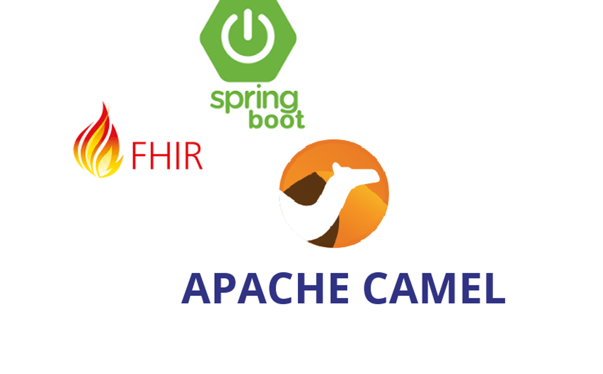

<div style="text-align: center;">

</div>

# 3rd Activity: Transforming HL7V2/CDA data to FHIR R4 with Apache Camel and Spring Boot

## Introduction

This is the base code for the 3rd activity in HSA, within the MUIT (Master's Degree in Telecommunication Engineering) of the University of Seville. It's a modified version of the module `fhir` from [https://github.com/apache/camel-spring-boot-examples](https://github.com/apache/camel-spring-boot-examples), where you can find additional examples of interest for learning Camel.

This is an example application demonstrating the definition of Camel routes and their execution as a Spring Boot application. The `camel-fhir` and `camel-hl7` components are used, along with `camel-spring-boot` for setup.

The project demonstrates multiple approaches for route specification and message processing:

**Route Implementation Options:**
- **Java DSL Routes**: Located in `src/main/java/sample/camel/routes/` package
- **YAML DSL Routes**: Located in `src/main/resources/routes/` folder
- **Custom Processors**: Specialized message processors in `src/main/java/sample/camel/processors/` package

**Available Processing Routes:**
- **Observation Processing**: `FromObservationFile2FHIRRoute` - Process HL7 ORU messages to create FHIR Patient resources and send them to an external FHIR server (crazy use case)
- **Patient Registration**: `FromRegisterFile2FHIRRoute` and `FromRegisterPut2FHIRRoute` - Process Patient Register HL7 ADT messages to create FHIR Patient resources, and send them to an external FHIR server
- **YAML routes**: Some samples of routes developed with YAML declarations

These examples receive **HL7V2** files containing patient register or observation data from a directory or HTTP endpoints, converts them to **FHIR R4** resources, and uploads them to a configured FHIR server.

The application can use either a local FHIR server (using Docker) or the external test server [http://hapi.fhir.org/baseR4](http://hapi.fhir.org/baseR4) for testing purposes.

By default, the example uses the URL of the external test server and **FHIR R4** as the version. Camel routes monitor `target/work/fhir/input` as the directory for HL7V2 files. You can edit the `application.properties` file to override defaults and provide your own configuration.

To load Java DSL routes in the Spring Context you must uncomment the @Component tag

To load YAML routes in the Spring Context you must uncomment `#camel.main.routes-include-pattern=file:*.camel.yaml,classpath:*.camel.yaml` and comment
`camel.main.routes-exclude-pattern=file:*.camel.yaml,classpath:*.camel.yaml` in application.properties file.

The project analyzes different input methods including file system monitoring and HTTP endpoints for receiving HL7 messages.

## Prerequisites & Dependencies

To build and run this example, you need:

- **Java 17** or higher
- **Maven** for dependency management 
- **Docker** (optional, for local FHIR server)

### Core Components

This project includes the following key components:

- **Routes**: Multiple Camel routes for different HL7 message types
  - `FromRegisterFile2FHIRRoute` - Patient registration via file system
  - `FromRegisterPut2FHIRRoute` - Patient registration via HTTP endpoint  
  - `FromObservationFile2FHIRRoute` - Observation processing via file system
- **Processors**: Custom processors for HL7 to FHIR transformation
  - `Hl7Register2FhirPatientProcessor` - Converts HL7 ADT to FHIR Patient
  - `Hl7ToFhirProcessor` - General HL7 to FHIR conversion
  - `VerifyHl7Type` - Validates HL7 message types
  - `OutcomeProcessor` - Handles FHIR operation outcomes

The complete dependency configuration is listed in the `pom.xml` file.
## Build

You can build this example using:

```bash
mvn package
```

## Run

In default mode the application uses an online test server to send Patient info, so you don't need to run a FHIR server, just use:

```bash
mvn spring-boot:run
```
But if you want to run your own fhir server you will need **Docker** installed.
Before running your application you could execute this command to deploy FHIR server:

```bash
docker run -p 8081:8080 -e hapi.fhir.fhir_version=R4 -e hapi.fhir.reuse_cached_search_results_millis=-1 hapiproject/hapi:v6.8.3
```
## Test

### Testing with Sample Data

The project includes sample HL7 data files in `resources/data/`:

- `sample.admision` - HL7 ADT patient register message
- `sample.observation` - HL7 ORU observation message

To test the application:

1. For routes reading files from disk you must copy any of these files to `target/work/fhir/input/`
2. For routes receiving http request you could use Postman to send a put request with the hl7 message in the body field
3. Processed FHIR resources will be sent to the configured FHIR server when needed

The Camel application can be stopped pressing `Ctrl+c` in the shell.

### To get health check

To show a summary of spring boot health check
```bash
curl -XGET -s http://localhost:8080/actuator/health
```
## Extended information

You can have extended information about the provided code in [architecture.md](/architecture.md)
