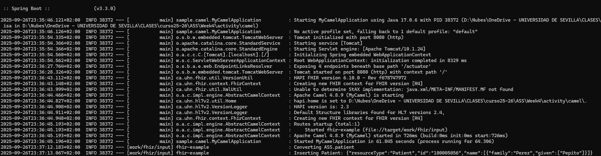

# 3th Activity: Transforming HL7V2/CDA data to FHIR R4 with Apache Camel and Spring Boot

<div style="text-align: center;">

</div>
## Introduction

This is the base code for the 3th activity in HSA, within the MUIT (Master Degree in Telecomunication Engineering) of the University of Seville.
It`s an example application of the definition of camel routes and their execution as an spring boot application.
In this case the `camel-fhir` component is used. We'll be using `camel-spring-boot` as well for an easy setup.
We are going to analize both techniques for route specification:

	- As a Java DSL: The Camel route is located in the `MyCamelRouter` class.
	- As a YAML file: The same rout is located in `resource` folder.

This example will read **HL7V2** files with patients data from a directory, convert them to **FHIR R4** patients and finnaly upload them to a configured FHIR server.

The example could installs `hapiproject/hapi:v4.2.0` docker image as local FHIR server, but in default configuration the external server for test [http://hapi.fhir.org/baseR4](http://hapi.fhir.org/baseR4) is used.

By default, the example uses the URL of this external server and **R4** as the FHIR version. Camel route uses `target/work/fhir/input` as the directory to look for HL7V2 patients.
However, you can edit the `application.properties` file to override the defaults and provide your own configuration.
You can deploy a local fhir server in `http://localhost:8081/fhir` following the instructions in run section.

## Prerequisites & Dependencies

To build and run this example, you need **Java** and **Docker** installed. This project uses **Maven** for dependency management.

The core dependencies for this project are listed in the `pom.xml` file
## Build

You can build this example using:

```bash
mvn package
```

## Run

Before running your application you could execute this command to deploy FHIR server:

```bash
docker run -p 8081:8080 -e hapi.fhir.fhir_version=R4 -e hapi.fhir.reuse_cached_search_results_millis=-1 hapiproject/hapi:v6.8.3
```

But in default mode the application uses an online test server, so you don´t need to execute this command. Then you can run this example using:

```bash
mvn spring-boot:run
```

Copy any of the files located in the resources/data folder into the folder target/work/fhir/input.
You should see and output similar to this:
<div style="text-align: center;">

</div>

The Camel application can be stopped pressing `Ctrl+c` in the shell.

### To get health check

To show a summary of spring boot health check
```bash
curl -XGET -s http://localhost:8080/actuator/health
```

